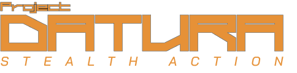

## Synopsis
A stealth videogame inspirted by classic 6th generation stealth and survival horror games.

## About
Project DATURA was my final year project, developed entirely by me. The idea was to produce a vertical slice/demo in the Unity game engine, along with production of a game design doc, development pipelines, assets and helped by managing the project with agile methodology. Originally, the game was set to feature multiple developers and artists, but due to lack of availabilty from the team members planned to be included, I ended up downsizing the scope of the game so that I could work on all the assets solo. 

The big things I worked on were 2D and 3D assets, coding, sound design and the documentation. The game design doc can be found [here](https://docs.google.com/document/d/1m_b2BC3Zi4fAVv6TOGOi2D7CPaNaTyGS3-CPFGkFjRM/edit?usp=sharing).

### Sound Design

Since the game would feature a variety of weapons and items to help progress in levels, the majority of sound design work would be in creating sound effects for these weapons and for interactions with these items. To achieve this, I relied mostly on audio from the Sonniss GDC packs, which are small collections of professional recordings of various natures made free and public domain. These recordings are mostly raw, so for the firearm soundeffects, I used Bitwig Studio to process, mix and normalize the sounds and make them acceptable for use in a game.

Another big thing was recording voicework. Enemies in stealth games, particularly in my references, often speak to give the player some indication of what they are doing and in what state they are in (for example, an enemy might say "what was that noise" to tell the player they might have heard their footsteps, or the player might hear a radio alert should they be spotted to let them know the enemies have been alerted to them), so it was imperative to create voice snippets for our enemies. For this demo, I decided to pitch up my voice by a few cents and add filters to make the voice sound more robotic in order to emulate how enemies sound in [i]Metal Gear Solid 2[/i]'s VR missions mode.

Below is a small demo reel showing the sound effects I made along with the game's voice work.



### 2D UI
2D UI assets were made in Illustrator, then exported to fit the game's UI. I started out making standard white sillouettes of the game's items, but after introducing non lethal firearms and different types of item, I decided to color code them based on type. Inspired by Metal Gear Solid 2, I made lethal weapons red and non lethal weapons blue. For items, general items were made blue, healing items were made green, and ammo/weapon attachments were made red.

[sprites](sprites.png)

### 3D 
For 3D assets I tried to keep things simple in order to both use my time more efficiently and also to maintaing a more stylized PS2 like aesthetic. Most of the game's models were based off of primitives, and the textures were made in Asperite to give them a pixel art like look similar to the game Signalis.

[3dg](3dgif1.png)