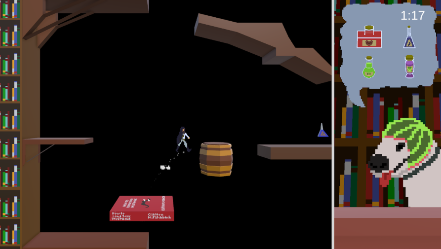
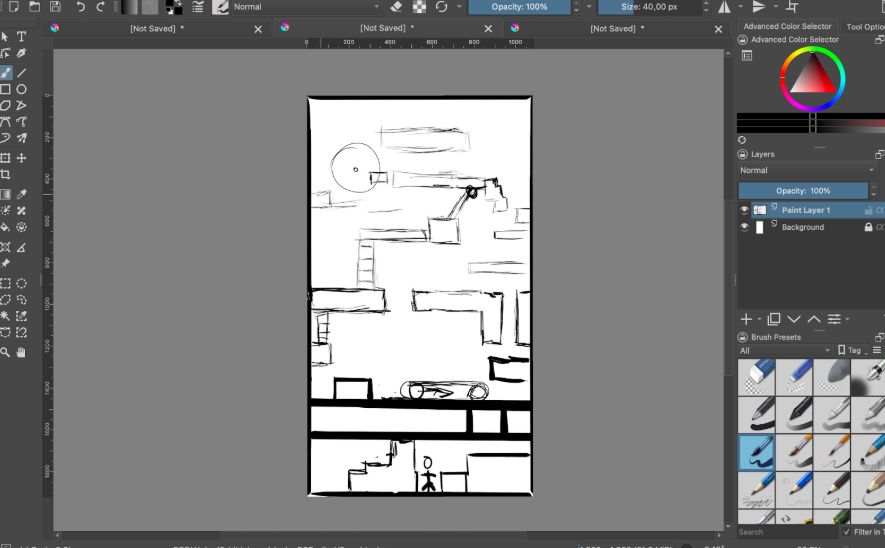

## Synopsis
A two player game where one player controls a small shopkeeper traversing his warehouse, and another player relays customer’s orders.
## Write-up
This project was made for a 2023  game jam in IPCA (Polytechnic Institute of Cávado and Ave), whose main theme was “interaction”. Right from the start we wanted to make a two player game, and we imagined a platformer whose objective was controlled by another player. My work here was game design, level design and 3D modeling. It can be played on the game jam’s Itch.io [here](https://josal.itch.io/mysthical-shopkeepers).

