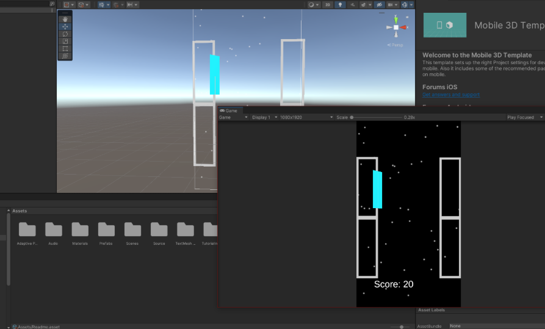
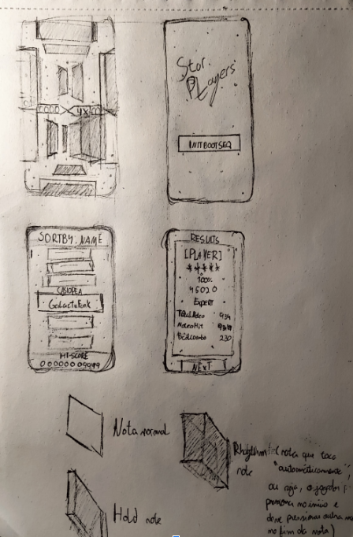
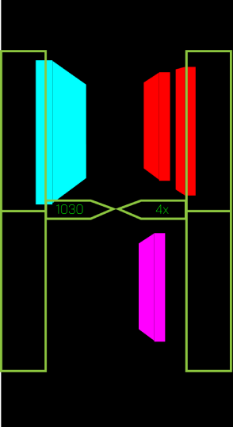
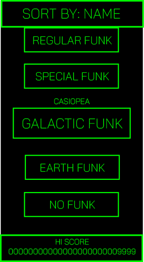

## Synopsis
An odd sort of stars have appeared in the vast emptiness of space. They follow the sound of music and fall to its beat. Your job is to capture them.
## Write-up
This project was made for a course about design documentation and storyboarding. The idea was to create a rhythm game for mobile platforms that revolved around one hand gameplay, in order to capture a casual audience while keeping more dedicated players happy, mostly inspired by Guitar Hero’s popularity in the early 2000s and with dedicated players to this very day. As a result, I ended up sketching out the UI and design for the game, as well as creating a full design document which can be found [here](downloads/DDJDStarplayers.pdf) (in portuguese). Below is a short proof of concept along with sketches on paper and small prototypes of those sketches made in Illustrator.

