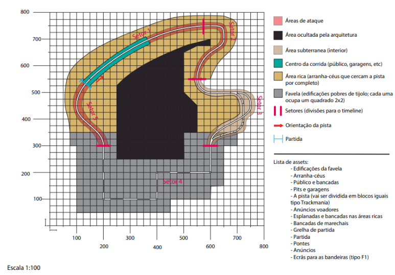
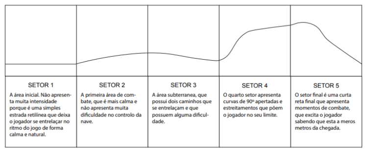

## Synopsis
In the future, a new motorsport has been created: maglev racing. Its popularity is at an all time high by the 2070s, but after a major pandemic, the world’s inequalities become dramatically worse. Play as an infiltrated revolutionary in the World Maglev championship to expose the rich magnate that controls it and his crimes.

## About
Venturi was a capstone project for the first semester of the 2022/2023 academic year. I worked with just one other person and our main areas of work were digital architecture and level design and complete worldbuilding. The work displayed here is the plan for the sole map developed for the demo that was made at the end of the semester, along with a graph displaying the intensity and pace of the track during a complete lap. The grid was created at an a accurate scale by *Hugo Xavier* along with the graph, and the track layout and planning, area design (and their color coding), index and graph data along with the relevant notes were made by me.    

The map was based on an infamous favela in Brazil known as Paraisópolis, known for neighbouring a considerably wealthier area known as Morumbi. Imagery of the two zones is often used to highlight economic disparity in the region, and we decided to use a similar setting to host a sport run by the wealthy that has this disparity as a backdrop. Therefore, the map starts on a massively wealthy area (in yellow), and runs along skyscrapers and highways until reaching a cavernous area (in brown) where the track travels through an underground passageway, coming out on a massive tunnel connected to the favela (in gray). The track is placed on top of its roads and cars fly right next to the windows of the small unpainted houses, with tight corners reflecting the grid like planning of the streets present among the houses. The track then rises up high over a hill, flying back to the starting line in the richer areas. Of note are the red areas, where the player can get attacked by missiles and other dangerous threats, fired by richer spectators that can pay to legally influence the sport's results.

